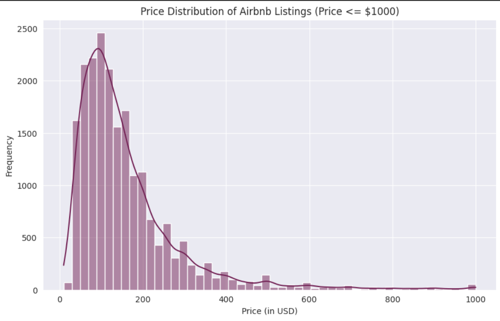
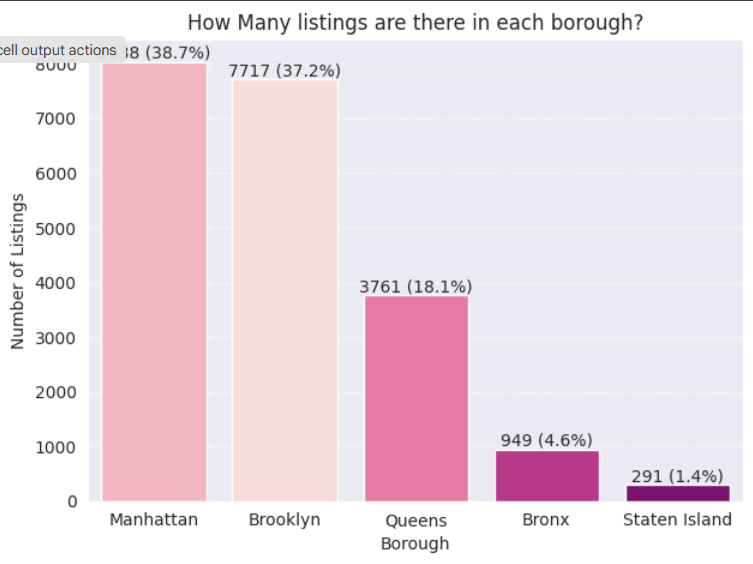
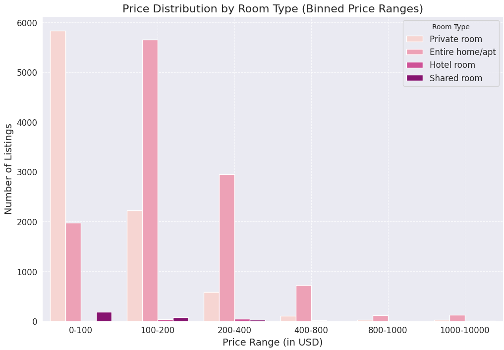
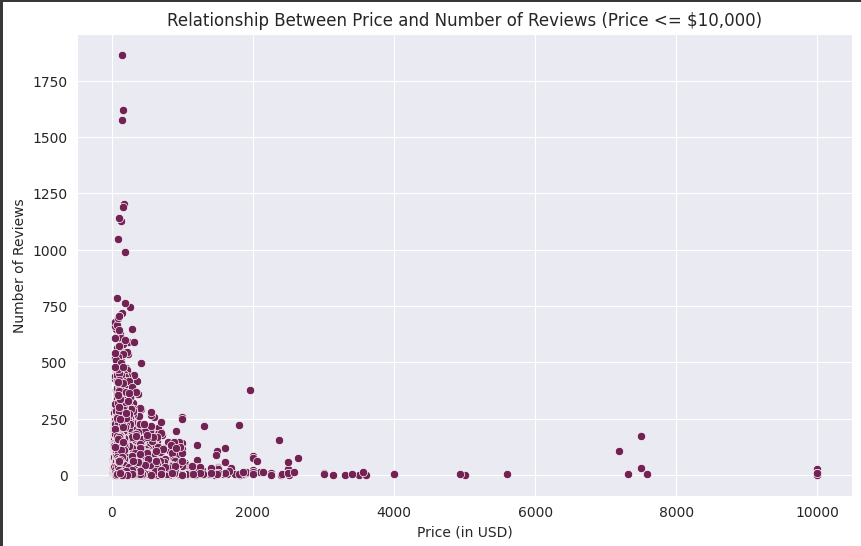

# 🗽 Airbnb NYC Listings Analysis (2024)

This project presents an in-depth data analysis and visualization of Airbnb listings in New York City using the 2024 dataset. It includes exploratory data analysis (EDA), data cleaning, and multiple visualizations to understand pricing, room types, borough distribution, and more.

---

## 📦 Dataset

- **Source**: [Kaggle - New York Dataset](https://www.kaggle.com/datasets/vrindakallu/new-york-dataset)
- **File Used**: `new_york_listings_2024.csv`
- **Downloaded using**: `kagglehub`

---

## 🔧 Technologies Used

- Python 🐍
- Pandas
- Matplotlib
- Seaborn
- KaggleHub (for dataset access)

---

## 📊 Project Workflow

### 1. **Data Preparation**
- Loaded the dataset via `kagglehub`
- Removed unnecessary columns like `latitude`, `longitude`, `host_id`, `name`, etc.
- Focused on relevant attributes such as:
  - `price`
  - `minimum_nights`
  - `number_of_reviews`
  - `reviews_per_month`
  - `availability_365`
  - `bedrooms`, `beds`, `baths`
  - `rating`

### 2. **Price Distribution**
- Plotted histogram of all prices
- Filtered outliers (`price > $1000`) for better visibility
- Created price bins and visualized how listings fall into each price range

### 3. **Listings by Borough**
- Visualized listing counts for each borough (`Manhattan`, `Brooklyn`, etc.)
- Annotated the chart with counts and percentages
- Compared **average prices by borough**

### 4. **Room Type Analysis**
- Analyzed distribution of price ranges across different `room_type`s (`Entire home/apt`, `Private room`, etc.)
- Compared average price per room type
- Visualized the relationship between:
  - `price` and `number_of_reviews`
  - Average reviews by room type

---

## 📈 Key Insights

- Most listings are concentrated in **Manhattan** and **Brooklyn**
- **Entire homes/apartments** are priced significantly higher than **private** or **shared rooms**
- There is a **positive correlation** between `price` and the **number of reviews**, especially at lower price ranges
- Boroughs like **Manhattan** tend to have **higher average prices**

---

## 📷 Sample Visualizations

Some of the visualizations included in the project:

---
